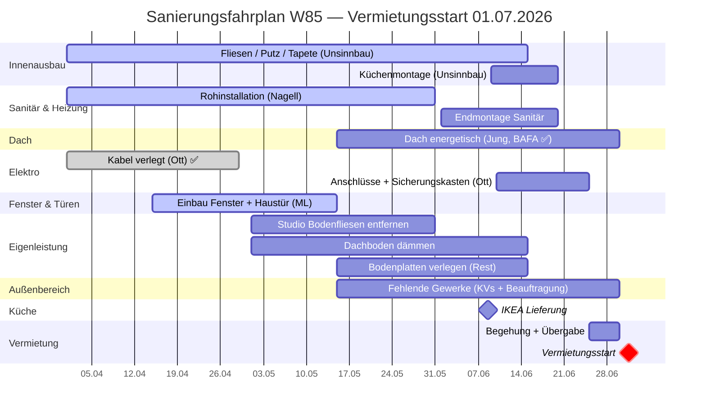

# Sanierung W85 — Projektplan

> Stand: 29.04.2026 | Ziel: Vermietungsstart **01.07.2026**

Siehe auch: [[budget-dashboard]] | [[README Sanierung W85]] | [[open-loops]]

---
---

## Teil 1 — Fehlende Kostenvoranschläge

> Fünf Gewerke sind geplant, aber noch ohne KV.
> Diese Positionen sind im aktuellen Budget von 180.000 € **nicht enthalten**.
> Alle Gewerke sollen vor Vermietung abgeschlossen sein.

---

### Übersicht

| # | Gewerk | Beschreibung | Priorität | Handwerker | Deadline |
|---|--------|-------------|-----------|------------|---------|
| 1 | Terrassenbelag | Erneuerung Terrassenbelag | Hoch | Offen — KV anfordern | Vor Vermietung |
| 2 | Podest Haustür | Erneuerung Podest im Hauseingangsbereich | Hoch | Offen — KV anfordern | Vor Vermietung |
| 3 | Garagentor | Erneuerung Garagentor | Mittel | Offen — KV anfordern | Vor Vermietung |
| 4 | Zaun Altkönigstraße | Doppelstabmatte 8 m + Tür 1 m, 180 cm Höhe, anthrazit | Mittel | Offen — KV anfordern | Vor Vermietung |
| 5 | Verkleidung | Eingang + Gartenschuppen — Rauspund | Mittel | Offen — KV anfordern | Vor Vermietung |

---

### Gewerk-Details

#### 1 · Terrassenbelag
- **Beschreibung:** Bestehenden Terrassenbelag erneuern
- **Handwerker:** Noch kein Handwerker beauftragt — ggf. Unsinnbau anfragen
- **Nächster Schritt:** KV anfordern

#### 2 · Podest Haustür
- **Beschreibung:** Eingangsbereich / Podest vor Haustür erneuern
- **Handwerker:** Noch kein Handwerker beauftragt — ggf. Unsinnbau anfragen
- **Nächster Schritt:** KV anfordern

#### 3 · Garagentor
- **Beschreibung:** Bestehendes Garagentor ersetzen
- **Handwerker:** Noch kein Handwerker beauftragt — Fachbetrieb Tore/Antriebe
- **Nächster Schritt:** KV anfordern

#### 4 · Zaun Altkönigstraße
- **Beschreibung:** Doppelstabmatte, 8 m Länge + 1 m Tür, 180 cm Höhe, anthrazit
- **Handwerker:** Noch kein Handwerker beauftragt — Zaunbauer / Metallbau
- **Nächster Schritt:** KV anfordern

#### 5 · Verkleidung Eingang + Gartenschuppen
- **Beschreibung:** Rauspund-Verkleidung Eingangsbereich und Gartenschuppen
- **Handwerker:** Noch kein Handwerker beauftragt — ggf. Unsinnbau oder Zimmermann
- **Nächster Schritt:** KV anfordern

---
---

## Teil 2 — Zeitplan bis Vermietungsstart

---

### Meilensteine

| Datum | Meilenstein | Status |
|-------|------------|--------|
| 29.04.2026 | Budget-Dashboard + Projektplan erstellt | ✅ |
| 29.04.2026 | NASPA KfW-Anfrage gesendet | ✅ |
| 29.04.2026 | Budget-Check-Anfrage an Unsinnbau gesendet | ✅ |
| Laufend | Elektro Ott — Kabel verlegt (Rohinstallation) | ✅ Teilweise |
| Ab Mitte Mai | Dachdecker Jung — Baubeginn Dach | Terminabstimmung läuft |
| Mai / Juni | KVs für fehlende Gewerke einholen + beauftragen | Offen |
| Mai / Juni | Eigenleistung: Studio Bodenfliesen, Dachboden, Bodenplatten | Offen |
| 08.06.2026 | IKEA Küche — Lieferung | Bestätigt |
| Juni 2026 | Küchenmontage durch Unsinnbau | Geplant |
| Juni 2026 | Elektro Ott — Anschlüsse + Sicherungskasten (wenn andere Gewerke fertig) | Offen |
| Juni 2026 | Abschluss alle Gewerke | Ziel |
| 25.–30.06.2026 | Begehung + Übergabe | Ziel |
| **01.07.2026** | **Vermietungsstart** | **Ziel** |

---

### Gantt-Diagramm



---

### Kritischer Pfad

```
Dach (Jung) ab Mitte Mai
    └── Fertigstellung Dach bis Ende Juni
          │
          └── Elektro Abschluss (wenn alle Gewerke stromfrei)
                │
                └── Endabnahme + Übergabe 25.–30.06.
                      └── Vermietungsstart 01.07.2026 ✓
```

> [!warning] Risiken
> 1. **Dach (Jung):** Verzögerung durch Wetter oder Materialmangel — größtes Einzelrisiko
> 2. **Elektro (Ott):** Abschluss abhängig vom Fortschritt aller anderen Gewerke
> 3. **Fehlende KVs:** Je später Beauftragung, desto enger wird der Zeitplan

---

### Eigenleistung

| Arbeit | Zeitraum | Abhängigkeit |
|--------|----------|-------------|
| Studio: Bodenfliesen entfernen | Mai 2026 | Vor Neuverlegung Bodenbelag |
| Dachboden dämmen | Mai / Juni 2026 | Unabhängig |
| Restliche Bodenplatten verlegen | Mai / Juni 2026 | Nach Fliesenentfernung Studio |

---
---

## Teil 3 — Budget-Controlling

---

### Grundsatz

> Alle Nachträge und Zusatzleistungen werden sofort im [[budget-dashboard]] erfasst.
> Schwellenwert für sofortige Eskalation: einzelner Nachtrag **> 2.000 €**.

---

### Nachtrag-Prozess

```
Handwerker meldet Mehrkosten
        │
        ▼
Ist der Nachtrag technisch notwendig?
        │
   Ja ──┴── Nein → Ablehnen / Alternativen prüfen
        │
        ▼
Schriftliche Bestätigung anfordern (WhatsApp reicht)
        │
        ▼
Betrag in budget-dashboard.md eintragen (Spalte "Mehrkosten")
        │
        ▼
Nachtrag > 2.000 €?
        │
   Ja ──┴── Nein → erledigt
        │
        ▼
Gesamtbudget-Check: noch im Rahmen?
        │
   Ja → weiter    Nein → Priorisierung überdenken
```

---

### Laufende Kontrolle

| Wann | Aktion |
|------|--------|
| Bei jeder Rechnung | Betrag in budget-dashboard.md eintragen (Gezahlt-Spalte) |
| Wöchentlich (Mo) | Restbudget prüfen — liegt Gesamtkosten bekannt noch unter 185.000 €? |
| Bei Nachtrag > 2.000 € | Sofort Gesamtplanung neu rechnen |
| Nach Abschluss Gewerk | Endabrechnung mit KV vergleichen, Differenz dokumentieren |

---

### Budget-Ampel

| Status | Gesamtkosten bekannt | Bewertung |
|--------|---------------------|-----------|
| Grün | bis 183.000 € | Im Rahmen |
| Gelb | 183.001 – 190.000 € | Beobachten — keine neuen Aufträge ohne Prüfung |
| Rot | über 190.000 € | Sofort priorisieren — welche Gewerke können verschoben werden? |

> Aktueller Stand (29.04.2026): **181.134 €** → **Grün**

---

### Noch ausstehende Nachtragsrechnungen

| Gewerk | Beschreibung | Geschätzte Kosten |
|--------|-------------|------------------|
| Unsinnbau | Estrich Bad OG (gebrochen, nicht im KV) | ~800 € |
| Ralf Müller OHG | Fußbodenheizung Bad OG (im Zuge Estrich verlegt) | ~1.200 € |
| Unsinnbau | Küchenmontage IKEA (separate Rechnung) | ~1.000 € |
| Fehlende Gewerke (5x) | Terrassenbelag, Podest, Garagentor, Zaun, Verkleidung | Offen |
| **Gesamt erwartet (ohne offene KVs)** | | **~3.000 €** |

---

*Entwurf — bitte Korrekturen und Ergänzungen mitteilen.*
